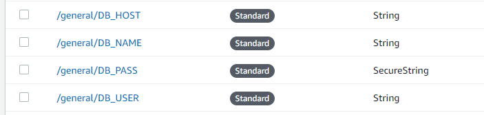

# Database-Connection
Script for connecting and executing queries into Postgres database.

# Prerequesites
Set-up your Database credentials into Parameter Store/AWS System Manager.

Install `psycopg2-binary`: `pip install psycopg2-binary`.

# Usage
1. Set the variable PATH_DB_NAME on file `config.py`.
2. Right your queries in the folder `Queries`
3. Run your Postgres commands. Check all the available functions on the file `database.py`
4. Check `example.py` for how to use the module.

# References & Acknowledgments
- https://www.psycopg.org/docs/usage.html
